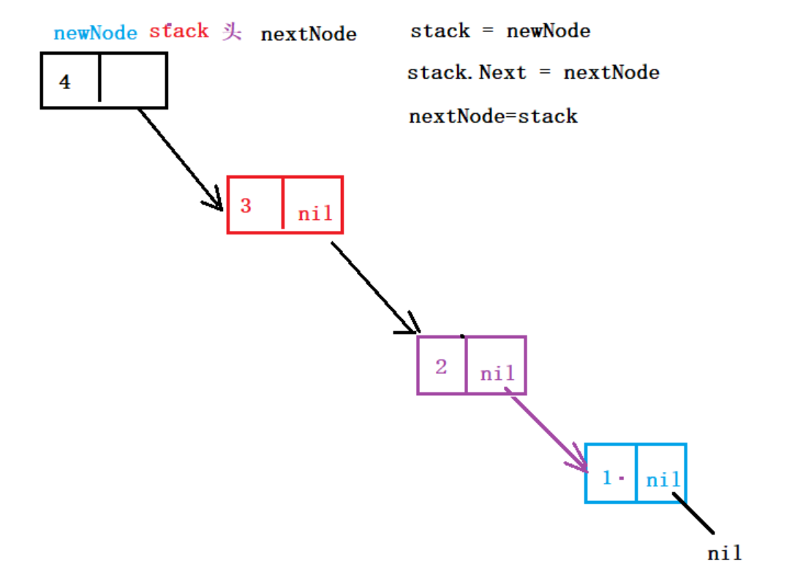

# 链式栈（stack）

### 特性：

- 链式栈，是受限的线性表。受栈型存储结构存储数据特性限制。 FILO 先进后出。
- 本质：单向链表。（通常没有头结点，第一个数据结点当成头结点）
- 只支持：头插（压栈）、头删（弹栈）
- 数据结构

```go
type StackNode struct {
    Data interface{}
    Next *StackNode
}
```

## 操作方法

1. 创建链栈 Create
2. 打印链栈 Print
3. 获取链栈长度 Length
4. 压栈（头插）Push
5. 弹栈（头删）Pop

### 1.创建链栈



#### 代码实现

```go
// 创建链式栈
func CreateStack(Data ...interface{}) *StackNode {
	//容错
	if len(Data) == 0 {
		return nil
	}
	// 创建头结点
	var stack *StackNode
	// 创建结点,保存 新结点的下一个结点
	var NextStack *StackNode
	// 循环获取元素,创建结点,组成链栈
	for _,v:=range Data{
		newNode:=new(StackNode)
		newNode.Data=v
		newNode.Next=nil
		stack=newNode
		stack.Next=NextStack
		NextStack=stack
	}
	return stack
}

```

#### 二.打印链栈表

```go
//打印链栈表
func PrintStack(s *StackNode) {
	for s!=nil  {
		fmt.Print(s.Data," ")
		s=s.Next
	}
}

```

#### 三.获取链栈的长度

```go
//获取链栈的长度
func (s *StackNode)LengthStack()int  {
	if s==nil {
		return 0
	}
	s=s.Next
	sH:=s.LengthStack()
	sH++
	return sH
}

```

#### 四.压栈（入栈）-- 头插

```go
//压栈（入栈）-- 头插
func (s *StackNode)Push(Data interface{})  {
	newStackNode:=new(StackNode)
	newStackNode.Data=s.Data
	newStackNode.Next=s.Next
	s.Data=Data
	s.Next=newStackNode
}

```

#### 五.弹栈（出栈）-- 头删

```go
//弹栈（出栈）-- 头删
func (s *StackNode)Pop()  {
	s.Data=s.Next.Data
	s.Next=s.Next.Next
}
```

## 链式队列（Queue）

### 特性：

- 链式队列，是受限的线性表。受队列存储结构存储数据特性限制。 FIFO 先进先出。
- 本质：单向链表。
- 只支持：尾插（入队）、头删（出队）
- 数据结构

```go
type QueueNode struct {
    Data interface{}
    Next *QueueNode
}
```

### 操作函数

1. 创建链式队列Create
2. 打印链式队列 Print
3. 获取队列元素长度 Length
4. 入队。Push
5. 出队。Pop

