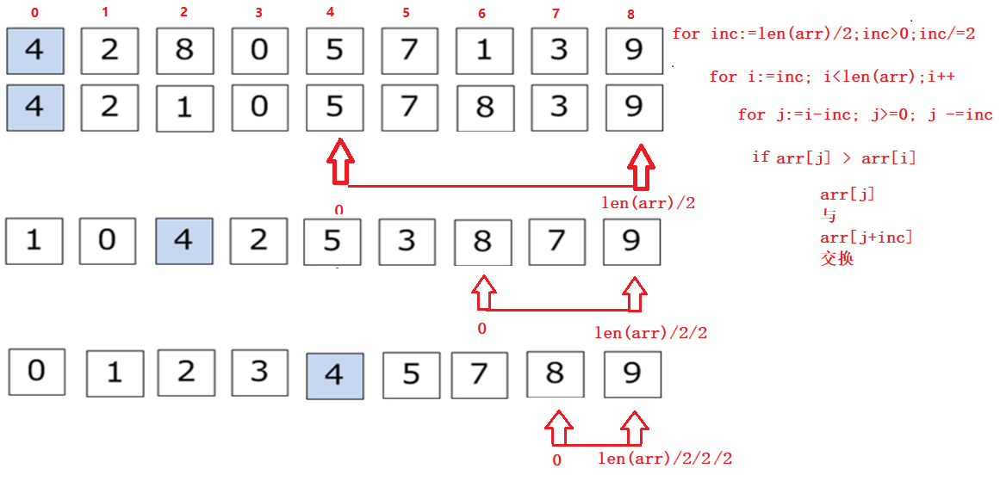
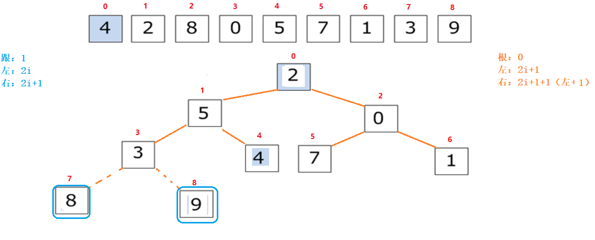

# 排序算法

- 排序算法稳定性界定：
  - 乱序数据集中，相同数据，排序后顺序不变。—— 稳定。
- 排序算法的审判标准：
  - 时间复杂度。 —— 越短越好
  - 空间复杂度。—— 越小越好
  - 可读性。 —— 越强越好

## 大 O 表示法

- 表示规则：
  - 只关注最高次项。
  - 只有常数项看做1.
  - 时间复杂度通常指的是最坏情况。

| 执行次数函数  | 阶       | 非正式术语 |
| ------------- | -------- | ---------- |
| 12            | O(1)     | 常数阶     |
| 2n+3          | O(n)     | 线性阶     |
| 3n2+2n+1      | O(n2)    | 平方阶     |
| 5log2n+20     | O(logn)  | 对数阶     |
| 2n+3nlog2n+19 | O(nlogn) | nlogn阶    |
| 6n3+2n2+3n+4  | O(n3)    | 立方阶     |
| 2n            | O(2n)    | 指数阶     |

​        

## 排序算法

### 冒泡排序

- BubbleSort


- #### 排序思想：

  1. 外层控制行
  2. 内层控制列
  3. 相邻元素比大小
  4. 满足条件交换


- #### 代码实现

```go
//冒泡排序实现
func BubbleSort(arr []int)  {
	//这个是计算要执行多少次
	start:=0
	//外层控制行
	for i:=0;i<len(arr)-1;i++ {
		//内层控制列
		for j:=0;j<len(arr)-1-i;j++ {
			start++
			//相邻进行比较
			if arr[j]>arr[j+1] {
				arr[j],arr[j+1]=arr[j+1],arr[j]
			}
		}
	}
	fmt.Println(start)
}

```

####  冒泡排序优化思想:

​		通过标记变量,控制内层循环比较次数

```go

//冒泡排序优化
func BubbleSort2(arr []int)  {
	//这个是计算要执行多少次
	start:=0
	//定义一个全局变量
	fig :=false
	//外层控制行
	for i:=0;i<len(arr)-1;i++ {
		//内层控制列
		for j:=0;j<len(arr)-1-i;j++ {
			start++
			//相邻进行比较
			if arr[j]>arr[j+1] {
				arr[j],arr[j+1]=arr[j+1],arr[j]
				fig=true
			}
		}
		if !fig {
			break
		}else {
			fig=false
		}
	}
	fmt.Println("执行次数:",start)
}
```

## 选择排序

- SelectSort()


#### 实现思路：

1. 外层控制行
2. 内层控制列
3. 将第一个元素当成最大值，记录下标 存 index
4. index对应的元素依次向后比较，记录大数的下标。
5. 将 index 对应的元素与 本行最后一个元素互换。

#### 代码实现

```go

func SelectSort(arr []int) {
	//fmt.Println("len =",len(arr))
	for i := 0; i < len(arr)-1; i++ {
		//fmt.Println(i)
		index := 0
		for j := 1; j < len(arr)-i; j++ {
			//fmt.Println("j =",j)
			if arr[j] > arr[index] {
				index = j
			}
		}
		arr[index], arr[len(arr)-1-i] = arr[len(arr)-1-i], arr[index]
	}
}
```


## 插入排序

- InsertSort()


#### 实现思路：

1. 将第一个元素划分为 “有序组”。
2. 从第二个元素开始，遍历依次取出元素（无序组元素），与有序组中元素比较
3. 无序组元素，比有序组元素小，循环依次比较有序组中的 所有元素， 依次交换

#### 代码实现:

```go
func InsertSort(arr []int) {
	//外层控制行
	for i := 1; i < len(arr); i++ {
		//把 无序组的第一个和有序组的最后一个进行比较  如果大于 就把无序组的第一个变成有序组的最后一个 然后排序
		if arr[i-1]>arr[i] {
			//就把无序组的第一个变成有序组的最后一个
			for j := i; j > 0; j-- {
				//排序
				if arr[j-1]>arr[j] {
					arr[j-1],arr[j]=arr[j],arr[j-1]
				}else {
					break
				}
			}
		}
	}
}
func main() {
arr := []int{6, 8, 3, 7, 5, 1, 4, 2, 9, 10}
InsertSort(arr)
fmt.Println(arr)
}
```

## 计数排序

- CountingSort()
- 利用数据统计方法，实现排序效果。
- 应用于特定场合。 100000个数， 介于 0-999 之间。


### 实现思路:

进行统计学实现大量重复数据 的排序

### 代码实现:

```go
func CountingSort(arr []int) []int {
	MapSort :=make(map[int]int)
	for _,v:=range arr{
		MapSort[v]+=1
	}
	var newarr []int
	for i:=0;i<1000;i++ {
		for j:=0;j<MapSort[i];j++ {
			newarr=append(newarr,i)
		}
	}
	return newarr
}

func main() {
	arr:=[]int{}
	rand.Seed(time.Now().UnixNano())
	for i:=0;i<100000;i++ {
		il:=rand.Intn(999)
		arr=append(arr,il)
	}
	arr=CountingSort(arr)

	fmt.Println(arr)
}
```

## 希尔排序

- ShellSort()
- 也叫 “缩小增量排序”


### 算法思想：

1. 确定增量值： len(arr)/2 --> len(arr)/2/2 --> len(arr)/2/2/2 --> len(arr)/2/2/2/2 .... --> 1
2. 将增量值位置 与 0 位置比较大小，交换， 按增量值后移
3. 比较对应数据后，按增量前移，比较之前的数据。



### 代码实现

```go

func ShellSort(arr []int) {
	//这个是增量
	for inc:=len(arr)/2;inc>=1;inc=inc/2 {
	//inc:=50
		for i:=0;i<len(arr)-inc;i++ {
				//发现小于 把数据加入  把前面的数据进行排序
				for j:=i;j>=0;j-=inc {
					fmt.Println("j:=",j)
					//前面都是有序的进行排序
					if arr[j]>arr[j+inc] {
						arr[j],arr[j+inc]=arr[j+inc],arr[j]
					}else {
						break
					}
				}
		}
	}
}
func main() {
	arr := []int{}
	rand.Seed(time.Now().UnixNano())
	for i := 0; i < 100; i++ {
		il := rand.Intn(100)
		arr = append(arr, il)
	}
	ShellSort(arr)
	fmt.Println(arr)
}

```

## 快速排序

QuickSort()


### 算法思路：

1. 确定基准值 base （第一个元素）
2. 定义两个 下标 i，j ，分别从 数组的起始、结束位置，对向移动。
3. j 对应 元素，如果比 base 大， 顺序前移。比base 小。 与 i 对应元素交换。
4. i 对应 元素，如果比 base 小， 信息后移。 比base 大。 与 j 对应元素交换。
5. 当 i、j 重合时， 产生分组。对分组 递归调用本函数。（i、j重合的位置，就是该元素，永久位置）

### 代码实现:

```go

func QuickSort(arr []int, start, end int) {
	if start < end {
		i, j, base := start, end, arr[start]
		for i < j {
			for i < j && arr[j] >= base {
				j--
			}
			arr[j],arr[i]=arr[i],arr[j]
			for i < j && arr[i] <= base {
				i++
			}
			arr[j],arr[i]=arr[i],arr[j]
			//fmt.Println("时间一",i)
		}
		//这里要进行递归调用
		QuickSort(arr,start,i-1)
		QuickSort(arr,i+1,end)
	}
}

func main() {
	//进行验证
	arr := []int{}
	rand.Seed(time.Now().UnixNano())
	for i := 0; i < 100; i++ {
		il := rand.Intn(100)
		arr = append(arr, il)
	}
	QuickSort(arr,0,len(arr)-1)
	fmt.Println(arr)
}
```

## 堆排序

*HeapSort()


- 最大堆，大顶堆，大根堆：将数据结合转换成树形存储，将各个子树中的最大值置于树根。
- 最小堆，小顶堆，小根堆：将数据结合转换成树形存储，将各个子树中的最小值置于树根。

实现思路：

1. 将乱序数组转换成完全二叉树。
   2. 将各个子树，按照 “大根堆” 交换数据。 将最大值，置于 整个树根结点上。
   3. 将根节点与 最后一个叶子结点，交换。将叶子结点摘下 (确定了一个最大数据)。
   4. 递归重复上述过程。



没有实现出来只要知道思想就可以了

可以参照07--HeapSort.go

## 二分法查找

只能应用于有序的数据序列。 乱序数据集，需先排序，再查找。

代码实现

```go
// 二分查找 BinarySearch(数据，元素) 返回值为下标
func BinarySearch(arr []int, num int) int {

	start := 0							//定义起始下标
	
	end := len(arr) - 1					//定义结束下标
	
	mid := (start + end) / 2			//定义中间基准值

	for i := 0; i < len(arr); i++ {
		
		if num == arr[mid] {			//中间基准值直接为查找值
		
			return mid					//返回下标
			
		} else if num > arr[mid] {		//查找值 比基准值大
			
			start = mid + 1				//查找右侧
			
		} else {						//查找值 比基准值小
			
			end = mid - 1				//查找左侧
		}
		
		mid = (start + end) / 2			//根据新起始、结束下标，再次设置中间基准值
	}
	
	return -1							//没有找到
}

func main() {
	//有序数据
	arr := []int{1, 2, 3, 4, 5, 6, 7, 8, 9, 10}

	index := BinarySearch(arr, 6)
	fmt.Println(index)
}
```

