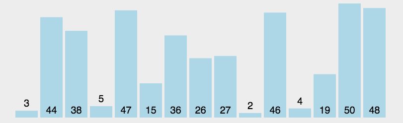

# 排序算法

- 排序算法稳定性界定：
  - 乱序数据集中，相同数据，排序后顺序不变。—— 稳定。
- 排序算法的审判标准：
  - 时间复杂度。 —— 越短越好
  - 空间复杂度。—— 越小越好
  - 可读性。 —— 越强越好

## 大 O 表示法

- 表示规则：
  - 只关注最高次项。
  - 只有常数项看做1.
  - 时间复杂度通常指的是最坏情况。

| 执行次数函数  | 阶       | 非正式术语 |
| ------------- | -------- | ---------- |
| 12            | O(1)     | 常数阶     |
| 2n+3          | O(n)     | 线性阶     |
| 3n2+2n+1      | O(n2)    | 平方阶     |
| 5log2n+20     | O(logn)  | 对数阶     |
| 2n+3nlog2n+19 | O(nlogn) | nlogn阶    |
| 6n3+2n2+3n+4  | O(n3)    | 立方阶     |
| 2n            | O(2n)    | 指数阶     |

​        

## 排序算法

### 冒泡排序

- BubbleSort


- #### 排序思想：

  1. 外层控制行
  2. 内层控制列
  3. 相邻元素比大小
  4. 满足条件交换


- #### 代码实现

```go
//冒泡排序实现
func BubbleSort(arr []int)  {
	//这个是计算要执行多少次
	start:=0
	//外层控制行
	for i:=0;i<len(arr)-1;i++ {
		//内层控制列
		for j:=0;j<len(arr)-1-i;j++ {
			start++
			//相邻进行比较
			if arr[j]>arr[j+1] {
				arr[j],arr[j+1]=arr[j+1],arr[j]
			}
		}
	}
	fmt.Println(start)
}

```

####  冒泡排序优化思想:

​		通过标记变量,控制内层循环比较次数

```go

//冒泡排序优化
func BubbleSort2(arr []int)  {
	//这个是计算要执行多少次
	start:=0
	//定义一个全局变量
	fig :=false
	//外层控制行
	for i:=0;i<len(arr)-1;i++ {
		//内层控制列
		for j:=0;j<len(arr)-1-i;j++ {
			start++
			//相邻进行比较
			if arr[j]>arr[j+1] {
				arr[j],arr[j+1]=arr[j+1],arr[j]
				fig=true
			}
		}
		if !fig {
			break
		}else {
			fig=false
		}
	}
	fmt.Println("执行次数:",start)
}
```

## 选择排序

- SelectSort()



#### 实现思路：

1. 外层控制行
2. 内层控制列
3. 将第一个元素当成最大值，记录下标 存 index
4. index对应的元素依次向后比较，记录大数的下标。
5. 将 index 对应的元素与 本行最后一个元素互换。

#### 代码实现

```go

func SelectSort(arr []int) {
	//fmt.Println("len =",len(arr))
	for i := 0; i < len(arr)-1; i++ {
		//fmt.Println(i)
		index := 0
		for j := 1; j < len(arr)-i; j++ {
			//fmt.Println("j =",j)
			if arr[j] > arr[index] {
				index = j
			}
		}
		arr[index], arr[len(arr)-1-i] = arr[len(arr)-1-i], arr[index]
	}
}
```


## 插入排序

- InsertSort()


#### 实现思路：

1. 将第一个元素划分为 “有序组”。
2. 从第二个元素开始，遍历依次取出元素（无序组元素），与有序组中元素比较
3. 无序组元素，比有序组元素小，循环依次比较有序组中的 所有元素， 依次交换

#### 代码实现:

```go
func InsertSort(arr []int) {
	//外层控制行
	for i := 1; i < len(arr); i++ {
		//把 无序组的第一个和有序组的最后一个进行比较  如果大于 就把无序组的第一个变成有序组的最后一个 然后排序
		if arr[i-1]>arr[i] {
			//就把无序组的第一个变成有序组的最后一个
			for j := i; j > 0; j-- {
				//排序
				if arr[j-1]>arr[j] {
					arr[j-1],arr[j]=arr[j],arr[j-1]
				}else {
					break
				}
			}
		}
	}
}
func main() {
arr := []int{6, 8, 3, 7, 5, 1, 4, 2, 9, 10}
InsertSort(arr)
fmt.Println(arr)
}
```

